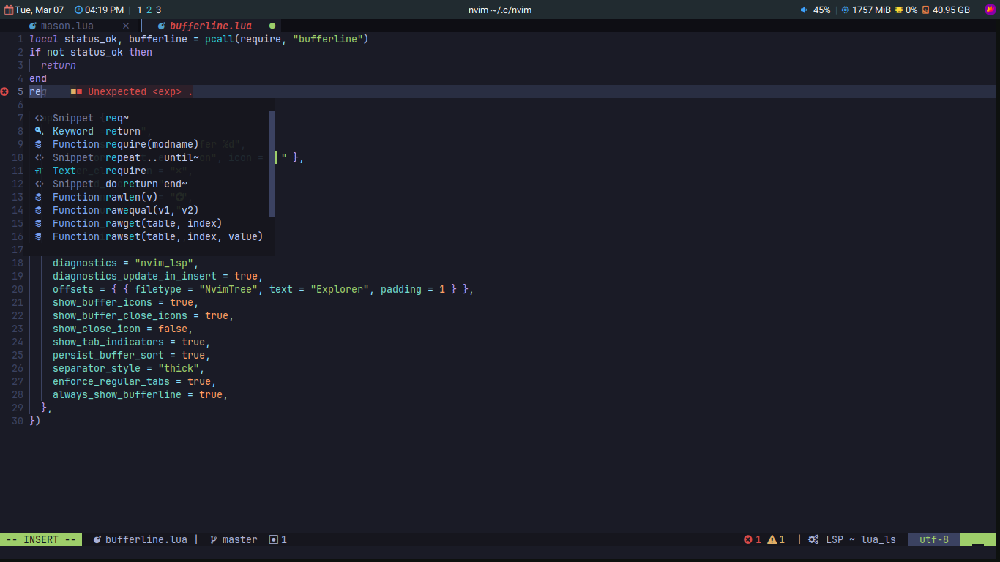
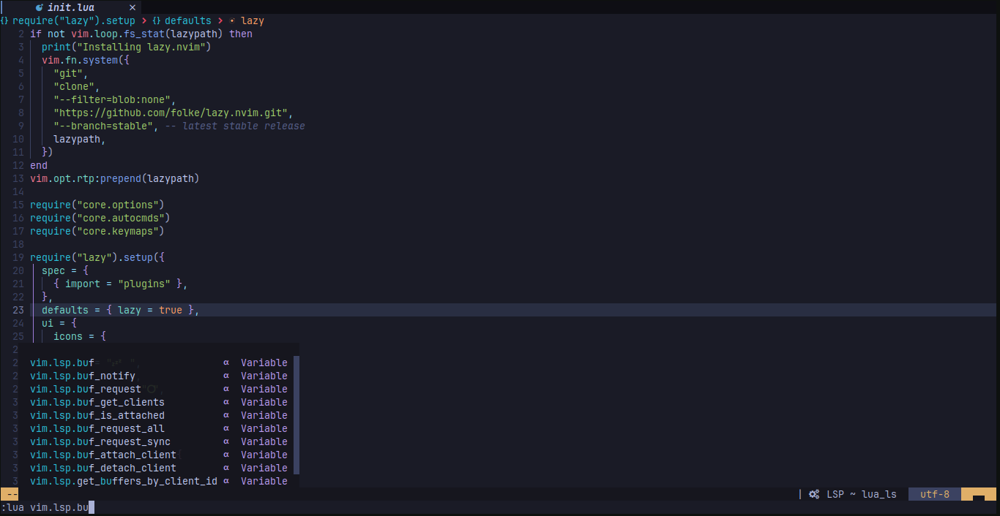
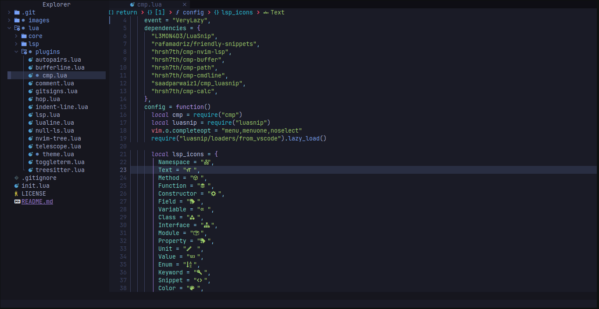
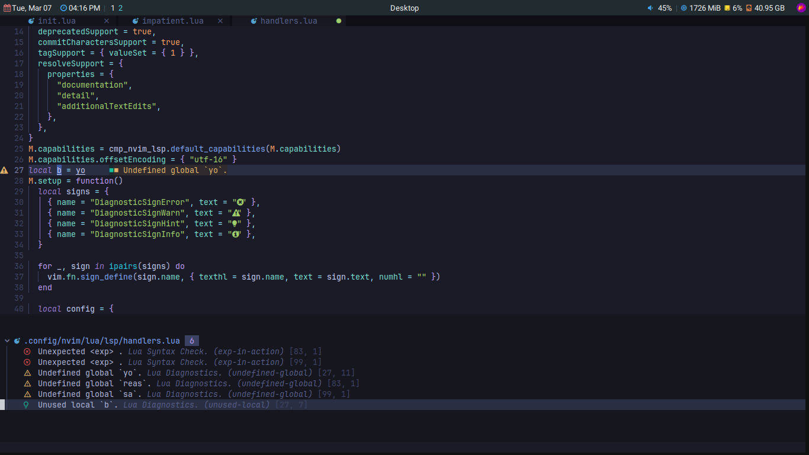
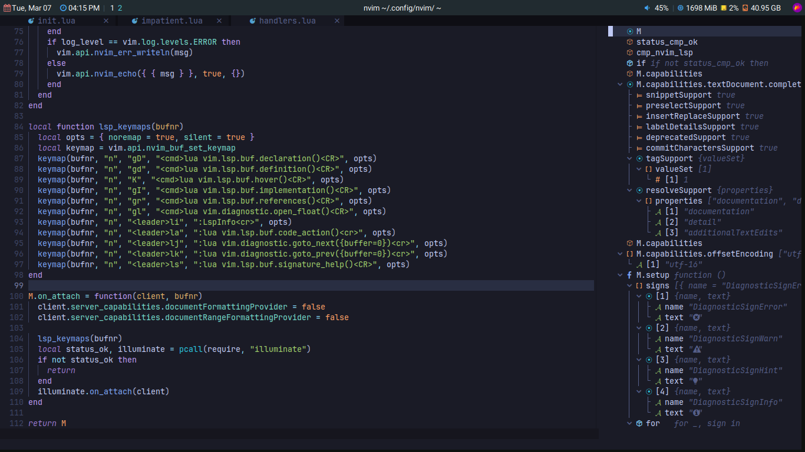
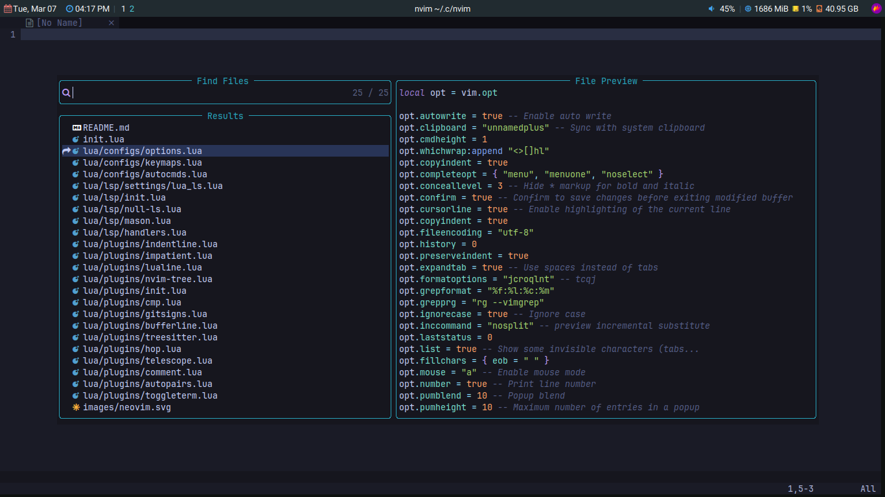

  

<h1 align="center">My neovim config for HTML, CSS, JavaScript,...</h1>

  
  
  
  

## 🚀 Introduction

This repository hosts my Neovim configuration for Linux. It's a minimal configuration with Lua and easy to customize and extend the config. You can clone this repository and use it but not good. A good configuration is personal, you should make your own unique config files.

⚠️ This config is only for the **lastest Neovim stable release**. If you are having an older neovim version, you should update neovim via package manager or download the lastest version from [Neovim official repository](https://github.com/neovim/neovim).

## ✨ Detail

- Plugin management: [lazy.nvim](https://github.com/folke/lazy.nvim)
- Status line: [lualine.nvim](https://github.com/nvim-lualine/lualine.nvim)
- File tree explorer: [nvim-tree](https://github.com/nvim-tree/nvim-tree.lua)
- Syntax highlighter: [nvim-treesitter](https://github.com/nvim-treesitter/nvim-treesitter)
- Fast buffer jump: [hop.nvim](https://github.com/phaazon/hop.nvim)
- Theme: [tokyonight.nvim](https://github.com/folke/tokyonight.nvim)
- Fuzzy searching: [telescope.nvim](https://github.com/nvim-telescope/telescope.nvim)
- Faster code commenting: [Comment.nvim](https://github.com/numToStr/Comment.nvim)
- Code, snippets, nvim commands completion: [nvim-cmp](https://github.com/hrsh7th/nvim-cmp) & [LuaSnip](https://github.com/L3MON4D3/LuaSnip)
- Language server protocol (LSP) support: [nvim-lspconfig](https://github.com/neovim/nvim-lspconfig) & [mason.nvim](https://github.com/williamboman/mason.nvim)
- Code Formatting: [null-ls](https://github.com/jose-elias-alvarez/null-ls.nvim)
- Faster matching pair insertion and jump: [nvim-autopairs](https://github.com/windwp/nvim-autopairs)
- Git integration: [gitsigns.nvim](https://github.com/lewis6991/gitsigns.nvim)
- Winbar code outline: [nvim-navic](https://github.com/SmiteshP/nvim-navic)
- And more...[plugins here](./lua/plugins/)

## ⚡️ Requirements

- Neovim
- A Nerd font
- Git
- GCC
- XClip (X11) for system clipboard support
- fd for telescope
- ripgrep for telescope

## ⌨️ Mapping table

<table>
  <tr>
    <th>Keyboard shortcuts</th>
    <th>Mode</th>
    <th>Description</th>
  </tr>
  <tr>
    <td>Ctrl + f</td>
    <td>Normal</td>
    <td>Code formatting</td>
  </tr>
  <tr>
    <td>Space + ff</td>
    <td>Normal</td>
    <td>Find files via telescope</td>
  </tr>
  <tr>
    <td>Space + fg</td>
    <td>Normal</td>
    <td>Grep via telescope</td>
  </tr>
  <tr>
    <td>F2</td>
    <td>Normal</td>
    <td>Toggle Nvim Tree</td>
  </tr>
  <tr>
    <td>Ctrl + s</td>
    <td>Normal</td>
    <td>Save</td>
  </tr>
  <tr>
    <td>Ctrl + m</td>
    <td>Normal</td>
    <td>Toggle symbols outline</td>
  </tr>
  <tr>
    <td>Tab</td>
    <td>Normal</td>
    <td>Next buffer</td>
  </tr>
  <tr>
    <td>Shift + Tab</td>
    <td>Normal</td>
    <td>Previous buffer</td>
  </tr>
  <tr>
    <td>Space + q</td>
    <td>Normal</td>
    <td>Close buffer</td>
  </tr>
  <tr>
    <td>Esc</td>
    <td>Normal</td>
    <td>Remove hightlight</td>
  </tr>
  <tr>
    <td>Space + n</td>
    <td>Normal</td>
    <td>Toggle relative number</td>
  </tr>
  <tr>
    <td>Ctrl + n</td>
    <td>Normal</td>
    <td>Toggle Trouble</td>
  </tr>
  <tr>
    <td>Ctrl + h</td>
    <td>Normal</td>
    <td>Left window focus</td>
  </tr>
  <tr>
    <td>Ctrl + j</td>
    <td>Normal</td>
    <td>Down window focus</td>
  </tr>
  <tr>
    <td>Ctrl + k</td>
    <td>Normal</td>
    <td>Up window focus</td>
  </tr>
  <tr>
    <td>1</td>
    <td>Normal</td>
    <td>Hop Word</td>
  </tr>
  <tr>
    <td>2</td>
    <td>Normal</td>
    <td>Hop Line</td>
  </tr>
  <tr>
    <td>Ctrl + l</td>
    <td>Normal</td>
    <td>Right window focus</td>
  </tr>
  <tr>
    <td>Alt + k</td>
    <td>Normal, Insert, Visual</td>
    <td>Move text line up</td>
  </tr>
  <tr>
    <td>Alt + j</td>
    <td>Normal, Insert, Visual</td>
    <td>Move text line down</td>
  </tr>
  <tr>
    <td>Space + /</td>
    <td>Normal, Visual</td>
    <td>Comment code</td>
  </tr>
</table>

And more...[keymaps](./lua/core/keymaps.lua)

## 📷 Screenshot

  
  
  
  
  
  

