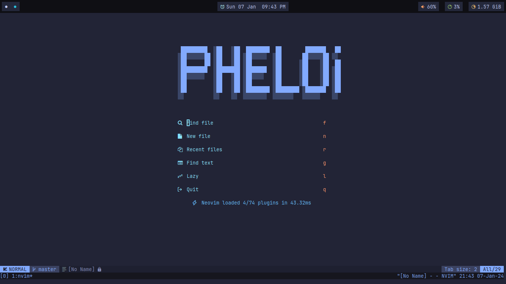

# PheloiVim - Neovim Configuration 🍻

[](https://github.com/2giosangmitom/PheloiVim/stargazers)
[](https://github.com/2giosangmitom/PheloiVim/forks)
[](https://github.com/2giosangmitom/PheloiVim/blob/master/LICENSE)
[](https://github.com/2giosangmitom/PheloiVim/issues)
[](https://github.com/2giosangmitom/PheloiVim/graphs/commit-activity)




## Introduction 🍇

Welcome to PheloiVim, a Neovim configuration tailored to enhance your editing experience! This configuration is meticulously crafted to offer a powerful, efficient, and highly customizable environment for all your editing needs.

> [!NOTE]
> This config is only for the **lastest Neovim stable release**. If you are having an older Neovim version, you should update Neovim via package manager or download the latest version from [Official repository](https://github.com/neovim/neovim).

## Features ✨

- **Clean and Minimalist**: Enjoy a clutter-free interface designed for maximum productivity.
- **Customizable**: Tailor every aspect of Neovim to match your preferences and workflow.
- **Lazy Loading with lazy.nvim**: Efficiently manage plugins loading to optimize startup time.
- **Efficient Keybindings**: Streamline your editing workflow with intuitive and efficient keybindings.

## Getting Started 🚀

> [!NOTE]
> You can clone this repository and use it but not good. A good configuration is personal, you should make your own unique configuration. If you still wish to explore my Neovim configuration:

1. **Clone the Repository**: Clone this repository to your local machine:

```bash
git clone https://github.com/2giosangmitom/PheloiVim.git ~/.config/nvim
```

2. **Explore**: Take some time to explore the included plugins and their features. Refer to their respective documentation for detailed usage instructions.

3. **Modify**: Feel free to modify and adapt the configuration to suit your own preferences. Remember, this setup is highly personalized and may require adjustments for your workflow.

4. **Enjoy**: Start editing with Neovim and experience a fast, efficient, and highly customizable editing environment!

## Contributing 🤝

As this configuration is highly personalized, I'm not actively seeking contributions or pull requests. However, if you have suggestions, improvements or spot any issues, feel free to open an issue or submit a pull request.

## Credits 🙌

PheloiVim draws inspiration from various community configurations and incorporates contributions from Neovim enthusiasts worldwide. Special thanks to the creators of the plugins included in this configuration for their invaluable contributions to the Neovim ecosystem.

## License 📄

This project is licensed under the MIT License. See the [LICENSE](LICENSE) file for more details.

---

Happy editing with PheloiVim! 🚀✨
